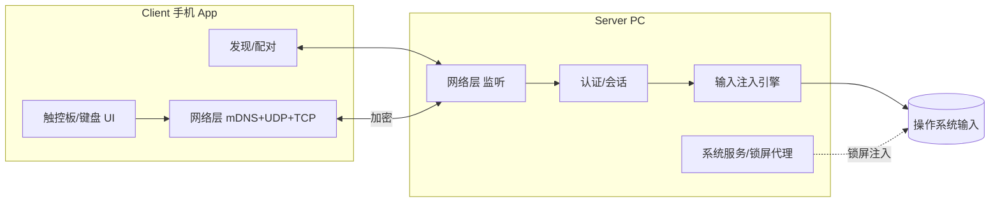

# 02 — 总体架构

## 系统视图


## 组件
**Client**：UI（触控板+键盘+按钮）、发现模块（mDNS+广播兜底）、配对认证、网络层（控制走 TLS/TCP，输入走加密 UDP）、本地设置。

**Server**：发现广播（mDNS announce）、连接管理与认证、会话/加密、输入注入引擎（平台抽象，已登录会话）、锁屏代理（Win 服务 / mac daemon）、托盘/菜单栏 UI 与配置。

## 双通道
- **控制面**（TCP/WebSocket+TLS）：握手、认证、配置、确认。可靠有序。
- **数据面**（UDP+加密）：高频鼠标/键盘，丢包容忍、状态最新优先、带序号。
握手在控制面协商会话密钥后用于数据面，详见 [05-protocol](05-protocol.md)。

## 分层
1. 表现层（Client UI / Server 托盘）
2. 应用层（手势识别、输入映射）
3. 协议层（消息编码、序列、加密）
4. 传输层（mDNS / UDP / TCP）
5. 平台适配层（robotgo / enigo + 各平台原生）

## 输入注入抽象
```
interface Injector {
  moveRel(dx,dy); moveAbs(x,y);
  button(btn, down); scroll(dx,dy);
  keyText(s); keyTap(code, mods); media(code);
}
```
实现：UserSessionInjector（已登录，robotgo/enigo）+ LockScreenInjector（平台特定服务）。锁屏不可用时回退普通注入并提示。

## 部署
- Server：单机本地双进程——前台 UI 应用 + 后台特权服务（锁屏）。MVP 可仅前台。
- Client：单 App。1:1 连接，后续多 server 切换。
- 全程 LAN，无云。

详见 [06-server](06-server.md) / [07-client](07-client.md)。
