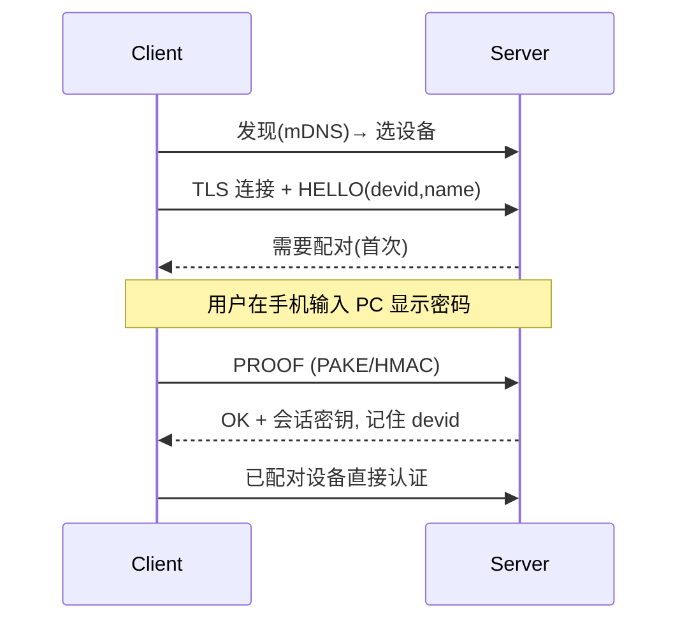

# 04 — 发现 / 配对 / 认证

## 1. 发现（同 WiFi 找 Server）
### 主方案：mDNS / DNS-SD
- Server announce 服务类型：`_remotemouse._tcp.local`，TXT 含 `name`、`platform`、`ver`、`port`、`devid`。
- Client 浏览该类型 → 解析得 IP:port → 列表展示。
- 多播端口 5353/UDP；客户端口设要求：
  - Android：`INTERNET`+`ACCESS_WIFI_STATE`+`CHANGE_WIFI_MULTICAST_STATE`+ multicast lock。
  - iOS：`NSLocalNetworkUsageDescription`、`NSBonjourServices` 列服务类型。

### 兜底：UDP 广播
- mDNS 被 AP 隔离时，Client 向 `255.255.255.255:PORT` 周期发现包，Server 回单播。
- 再兜底：手动输入 IP:port。

## 2. 配对流程

## 3. 密码认证
- Server 设连接密码（首启设置，菜单可改）。MVP 也可显示 6 位 PIN。
- **不传明文**：用 PAKE（推荐 **SPAKE2**/SRP）；或简版 HMAC 挑战-响应：
  - Server 发 nonce → Client 算 `HMAC(KDF(pwd), nonce)` → Server 校验。
- 防重放：nonce 一次性 + 时间戳。
- 成功后协商会话密钥供数据面 UDP 加密。

## 4. 受信设备
- 配对成功存设备公钥/devid；后续证书/密钥免密。
- Server 列表可撤销设备。

## 5. 边界
- 密码错误/超限锁定。AP 隔离提示手动 IP。多 Server 凭 devid 区分。
- 详见 [05-protocol](05-protocol.md) / [08-security](08-security.md)。
