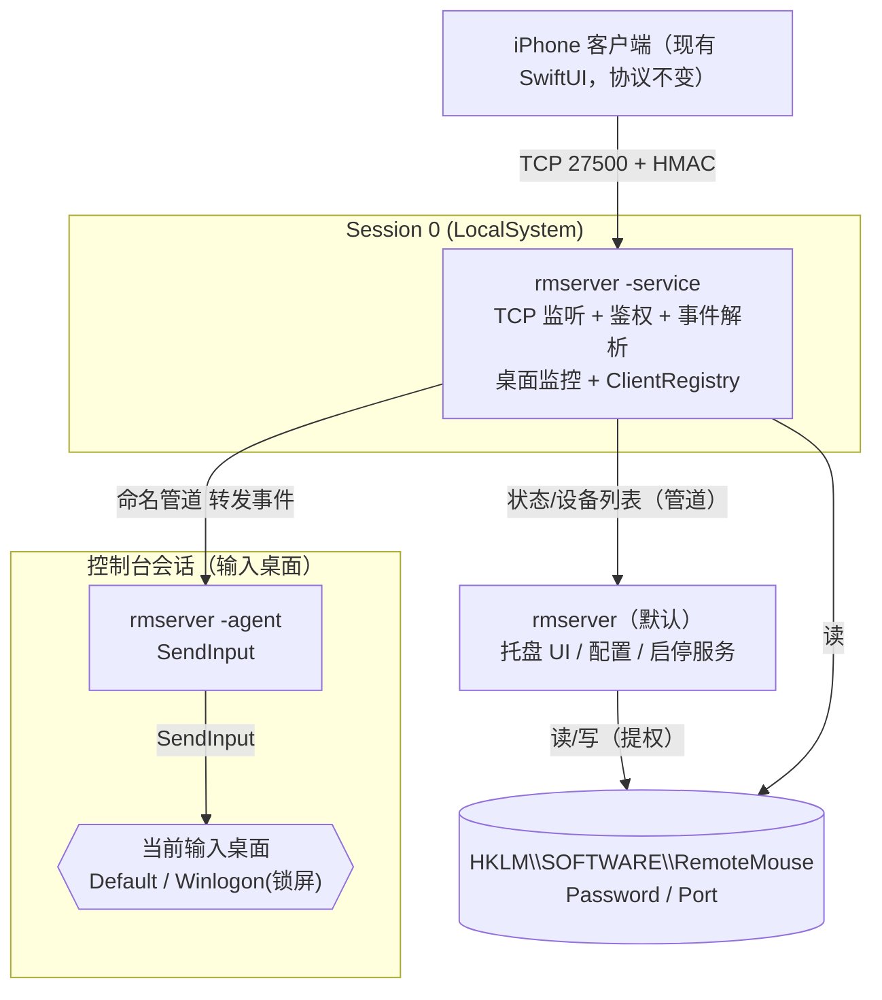

# Windows 锁屏注入（M5 POC）设计

- 状态：已评审，待实施
- 日期：2026-06-30
- 关联：`docs/09-lock-screen.md`、`docs/10-roadmap.md`（M5 拉伸目标）

## 1. 背景与问题

iOS 客户端已能连接 Windows server 并在**已登录解锁**状态下控制鼠标/键盘。但当 PC 锁屏、需要输入 Windows Hello PIN 解锁时，客户端发送的任何键盘事件都不生效。

原因不是 bug，而是 Windows 的安全设计：锁屏/登录/UAC 界面运行在**安全桌面（Winlogon secure desktop）**上。当前 server 是**普通权限的用户进程**，`SendInput` 只作用于它所在的 `Default` 桌面；普通权限进程无权 `OpenInputDesktop`/`SetThreadDesktop` 切到 `Winlogon` 桌面注入。

## 2. 目标 / 非目标

**目标（本次 POC，端到端）**
- 引入以 LocalSystem 运行的 Windows 服务，由它持有网络并把注入 agent 拉到**当前输入桌面**。
- PC 锁屏时，从 iPhone 输入 Hello PIN 即可解锁。
- 解锁态的常规控制（移动/点击/滚动/文本/按键）照常工作，走同一条注入路径。
- 保留现有托盘 UI 作为状态/配置界面；服务与 UI 通过注册表共享配置。

**非目标（本次不做，列入后续）**
- TLS / 链路加密（紧随其后的下一步，见 §11）。
- 代码签名、安装包、公证。
- macOS 锁屏（纯软件不可行，见 `docs/09`）。
- 自定义 Credential Provider、CtrlAltDel 触发等高级能力。
- WTS 会话通知优化（POC 用轮询）。

## 3. 方案概述（路线 A：SYSTEM 服务 + 按桌面拉起 agent）

业界（TeamViewer/AnyDesk）成熟模型，也是 `docs/09` 既定方向：

- **服务**（LocalSystem，session 0）持有 TCP 监听 + 鉴权 + 事件解析；监控当前输入桌面；用 `CreateProcessAsUser` 把 **agent** 拉到控制台会话的当前桌面（`Default` 或 `Winlogon`）；事件经**命名管道**转发给 agent。
- **agent**（控制台会话，绑定到输入桌面）只负责 `SendInput`，复用现有 `injector_windows.go`。
- **托盘 UI**（用户会话）不再监听 TCP、不再注入，转为状态/配置 + 服务安装/启停。

**被否决的备选**
- 路线 B（服务自身 `SetThreadDesktop`+`SendInput`，不拉子进程）：因 Session 0 隔离，session 0 线程无法 attach session 1 的桌面，走不通。
- 路线 C（ESP32/Pi Pico USB HID 桥）：需硬件，非纯软件，超范围；留作未来 fallback。

## 4. 架构

## 5. 组件：单二进制三模式

同一个 `rmserver.exe`，用命令行 flag 区分运行模式，复用同一份协议/注入代码。

| 模式 | 启动方式 | 运行账户/位置 | 职责 |
|------|----------|----------------|------|
| 默认（无 flag） | 用户登录 / 托盘 | 用户会话 | 托盘 UI：显示 IP/端口/密码、设备列表、安装/启停服务（UAC 提权）、读/写配置。**不监听 TCP、不注入** |
| `-service` | SCM 拉起 | LocalSystem（session 0） | 持 TCP 监听 + 鉴权 + 事件解析；桌面监控；拉起/维护 agent；管道转发事件；维护 ClientRegistry |
| `-agent -pipe <name>` | 服务 `CreateProcessAsUser` 拉起 | 控制台会话 + 当前输入桌面 | 连管道、读事件、`SendInput` |
| `-install-service` / `-uninstall-service` | 管理员手动 | 提权 | 注册/删除服务，写入初始配置到 HKLM |
| `-probe-desktop` | 开发手动 | 任意 | 循环打印当前输入桌面名，单独验证检测逻辑 |
| `-standalone` | 开发手动 | 用户会话 | 监听+注入单进程（仅 Default 桌面），不锁屏快速联调用 |

**配置（注册表）** `HKLM\SOFTWARE\RemoteMouse`：`Password`(REG_SZ)、`Port`(REG_DWORD)。安装服务时（提权）写入；托盘 UI 读取展示，改密码触发一次提权写入。

## 6. 数据流

1. iPhone 经 TCP 连服务，走现有 `hello → challenge → auth → auth_ok` HMAC 握手（协议不变）。
2. 鉴权通过后，服务读取后续 `move/button/scroll/text/key/ping` 事件行。`ping` 由服务直接回 `pong`；注入类事件转发给 agent。
3. 服务把事件**原样的换行 JSON（`In`）**写入命名管道。
4. agent 从管道读取，`json.Unmarshal` 成 `In`，走**与现 `server.go` 完全相同的 injector switch** 调用 `injector_windows.go`。
5. `SendInput` 作用于 agent 所在桌面 → 锁屏时即安全桌面，PIN 输入生效。

**统一注入路径**：不论锁屏与否，服务始终通过 agent 注入（解锁态 agent 在 `Default`，锁屏态在 `Winlogon`）。托盘 UI 不参与注入，避免双逻辑。

## 7. 桌面跟随与 agent 生命周期

服务内监控循环（POC 用轮询，约 300ms）：

1. `WTSGetActiveConsoleSessionId()` 取控制台会话 id。
2. `OpenInputDesktop(0, FALSE, GENERIC_READ)` + `GetUserObjectInformationW(UOI_NAME)` 取当前输入桌面名：`Default` / `Winlogon` / `Screen-saver`。
3. 维护当前 agent 绑定的 `(sessionId, desktop)`。当其变化（锁屏 `Default→Winlogon`、解锁反向、UAC 等）：**终止旧 agent → 在新桌面拉起新 agent**。进程桌面在创建时固定，跟随输入桌面最干净的做法是换进程重开。
4. `Screen-saver` 归一处理：按"是否安全桌面"决定取 token 策略（保守起见按 Winlogon 路径）。
5. 拉起失败（安全桌面切换瞬间可能短暂失败）→ 下一拍重试。

## 8. Token 获取（关键，分两种）

- **Default（已登录解锁）**：`WTSQueryUserToken(sessionId)` 取交互用户 token → `DuplicateTokenEx(..., TokenPrimary)` 得主令牌 → `CreateEnvironmentBlock`。
- **Winlogon（锁屏/登录）**：用户 token 取不到或无权访问安全桌面 → 在目标会话里找 `winlogon.exe`（`WTSEnumerateProcesses` 匹配 sessionId）→ `OpenProcess(PROCESS_QUERY_LIMITED_INFORMATION)` → `OpenProcessToken(TOKEN_DUPLICATE|TOKEN_QUERY|TOKEN_ASSIGN_PRIMARY)` → `DuplicateTokenEx(..., TokenPrimary)`，得到该会话的 SYSTEM 主令牌，可访问安全桌面。
- LocalSystem 需显式启用 `SeTcbPrivilege`、`SeAssignPrimaryTokenPrivilege`、`SeIncreaseQuotaPrivilege`（`AdjustTokenPrivileges`）。

## 9. 拉起 agent（CreateProcessAsUser）

- `STARTUPINFOW.lpDesktop = "WinSta0\\Default"` 或 `"WinSta0\\Winlogon"`（完整 窗口站\桌面 路径）。
- `CreateProcessAsUserW(hToken, exePath, "rmserver.exe -agent -pipe \\.\pipe\remotemouse-inject", NULL, NULL, FALSE, CREATE_UNICODE_ENVIRONMENT|CREATE_NO_WINDOW, env, NULL, &si, &pi)`。
- 保留 `pi.hProcess`，桌面切换或服务停止时 `TerminateProcess` 回收。

## 10. IPC 管道与事件帧

- 服务先建管道服务端 `\\.\pipe\remotemouse-inject`，再拉 agent；agent 连上后循环读。
- **帧格式直接复用现有换行 JSON `In` 事件**：服务转发 `move/button/scroll/text/key` 原样行；agent `json.Unmarshal` 后复用 injector switch。→ `proto.go` + `injector_windows.go` 原样复用，几乎零改动。
- 管道 DACL：授予 SYSTEM + 控制台交互用户读写；POC 放宽到 Authenticated Users（见安全段）。
- 桌面切换：旧管道随旧 agent 关闭，服务为新 agent 重建实例并重连。
- 设备列表回 UI：服务再开一个 `\\.\pipe\remotemouse-status`，UI 轮询取 `ClientRegistry.Snapshot()`。POC 中设备列表为次要项，可后置。

## 11. 安全

1. ⚠️ **PIN 走明文 LAN**：当前协议是 TCP 上的明文换行 JSON（TLS 是后续项）。用它打 PIN = 把操作系统凭据明文发过局域网，同网段可嗅探。**POC 决策：仅限可信家庭 LAN 使用；不记录 PIN；TLS 作为紧随其后的下一步**（自签名 + iOS 端钉证书指纹）。
2. **SYSTEM 注入面扩大**：服务以 SYSTEM 往安全桌面注入，唯一闸门是现有密码-HMAC 握手。保持"鉴权通过前不转发任何事件"，保留 3 次失败锁定。
3. **管道 DACL**：不能让低权限本地进程驱动 SYSTEM agent；POC 限 SYSTEM + 控制台用户（后续收紧）。
4. **不落盘 PIN**：文件日志对 `text`/`key` 内容脱敏，绝不记录按键内容。
5. **配置存储**：连接密码存 HKLM（连接口令，非 PIN；PIN 永不存储），后续可收紧 ACL。

## 12. 验证与测试

安全桌面无控制台、服务在 session 0 无可见输出，因此：

- **文件日志** `%ProgramData%\RemoteMouse\*.log`（SYSTEM 可写），服务与 agent 各写、带时间戳与桌面名；内容脱敏。
- `-probe-desktop` 模式单独验证桌面检测。
- **手测闭环**：
  1. 提权安装：`rmserver.exe -install-service -pass 1234 -port 27500`，`sc start RemoteMouse`。
  2. **先验解锁态**（Default）端到端注入打通（隔离掉锁屏变量）。
  3. `Win+L` 锁屏，看日志是否检测到 `Winlogon` 并用 winlogon token 在 `WinSta0\Winlogon` 拉起 agent。
  4. iPhone 打 PIN+回车 → 解锁。
  5. 解锁后回弹到 `Default`。
- 现有 Go 测试保持绿；为纯逻辑（桌面名→取 token 策略、事件帧/转发）加小单测；Win32 拉起/注入为真机手测。
- 回退：`-uninstall-service` + `sc delete RemoteMouse`；开发期用 `-standalone` 跑非锁屏路径。

## 13. 验收标准

- PC 锁屏时，从 iPhone 输入 Windows Hello PIN 即可解锁。
- 解锁态常规控制（移动/点击/滚动/文本/按键）照常工作，走同一 agent 路径。
- 锁屏↔解锁切换后，注入自动跟随到正确桌面，无需手动干预。

## 14. 涉及文件（预估）

- 新增：`server/service_windows.go`（服务骨架/安装/卸载，`golang.org/x/sys/windows/svc`+`mgr`）、`server/desktop_windows.go`（输入桌面检测）、`server/spawn_windows.go`（token + CreateProcessAsUser）、`server/agent_windows.go`（agent 模式 + 管道客户端）、`server/ipc_windows.go`（命名管道）、`server/config_windows.go`（HKLM 配置）。
- 修改：`server/main.go`（模式分发 flag）、`server/server.go`（监听/鉴权与 UI 解耦，事件转发给管道而非直接注入）、`server/ui_windows.go`（去掉本地监听/注入，加服务安装/启停 + 状态）、`server/autostart_windows.go`（服务设为 SCM 自启 `AutomaticDelayed`；托盘 UI 保留现有 HKCU Run 自启以展示状态）。
- 复用：`server/proto.go`（`In`）、`server/injector_windows.go`（`SendInput`）、`server/keys*.go`。

## 15. 后续（POC 之后）

- TLS（自签名 + iOS 端钉指纹），先于任何非可信网络使用。
- WTS 会话通知替代轮询；管道 DACL 收紧；HKLM 配置 ACL 收紧。
- 代码签名 / 安装包 / 公证（M6）。
